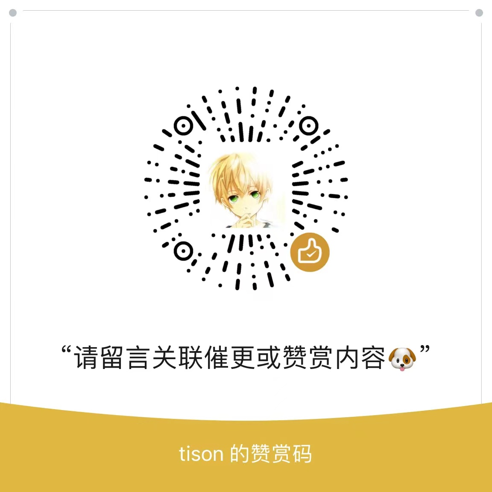

### Hi there 👋

- 👯 I’m looking to collaborate on [the Korandoru community](https://github.com/korandoru/town).
- 🤔 I’m looking for help with:
  - [Open-source Town](https://github.com/korandoru/town)
  - [Zeronos: A distributed consensus system](https://github.com/korandoru/zeronos)
- 💬 Ask me about:
  - streaming systems
  - distributed database
  - building open-source community
- 📫 Reach me: tison1096
- 😄 Pronouns: tison /tisən/
- ⚡ Fun fact: I'm a modern wizard.

### Sponsor

Welcome to sponsor my open-source works!

You can additionally associate the fund with sponsor content. Once the target is hitted, I'll deliver the content with high priority, typically within two weeks. 

(Currency Unit = Chinese Yuan)

| No. | Topic                                                            | Target | Raised | Status  |
| --- | ---------------------------------------------------------------- | ------ | ------ | ------- |
| 001 | Make money from open-source: From software, product to commodity | 127.00 | 0.00   | Pending |
| 002 | How to review contribution?                                      | 42.00  | 0.00   | Pending |
| 003 | The story of tests refactoring in Kvrocks                        | 42.00  | 0.00   | Pending |
| 004 | How to find an open-source community to participate              | 127.00 | 0.00   | Pending |
| 005 | Translation of Developer Experience Infrastructure (DXI)         | 127.00 | 0.00   | Writing |

Transalation:

1. 开源不赚钱：从软件、产品到商品
2. AS IS
3. Kvrocks 测试迁移的故事
4. 如何找到适合参与的开源社区
5. 【演绎】开发者体验的基础设施
